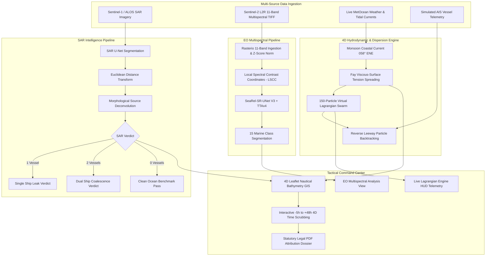

# SpillTheory · Cyber-Maritime Tactical Command Center

> **Autonomous AI-Driven Marine Oil Spill Intelligence, Dual-Modality Satellite Delineation (SAR + EO), 4D Lagrangian Hydrodynamics & AIS Vessel Attribution Platform**

[](https://fastapi.tiangolo.com)
[](https://reactjs.org/)
[](https://www.typescriptlang.org/)
[](https://pytorch.org/)
[](https://tailwindcss.com/)
[](https://leafletjs.com/)
[](https://python.org)
[](LICENSE)

---

## 🌊 Executive Overview

**SpillTheory** is an enterprise-grade cyber-maritime tactical intelligence and environmental defense platform. It equips coastal defense authorities and environmental agencies with automated satellite spill detection, forward drift forecasting, reverse origin backtracking, and kinematic AIS vessel attribution.

The platform provides two completely **independent satellite observation workflows**:

1. **Synthetic Aperture Radar (SAR)**: Spaceborne radar backscatter damping analysis (Sentinel-1 C-Band & ALOS PALSAR L-Band) for 24/7 all-weather day/night slick delineation and morphological source deconvolution (single ship vs. dual coalesced leaks).
2. **Optical Earth Observation (EO)**: High-resolution multispectral semantic segmentation via **SeaRel-SR-UNet V3** (Sentinel-2 L2R 11-band MSI), resolving 15 marine surface classes including thin slicks, thick oil, marine debris, and algal blooms.

> **Note on Workflow Independence**: SAR and EO operate as separate, decoupled pipelines. The user selects either SAR or EO from the tactical navigation rail. There is no multi-sensor fusion layer in the current scope.

---

## ⚡ Technical Architecture



---

## 📂 Repository Structure

```
SpillTheory/
├── README.md                       # Master platform overview & guide
├── .gitignore                      # Git exclusion rules (weights, caches, outputs)
├── .env.example                    # Environment configuration template
├── requirements.txt                # Python backend dependencies
├── package.json                    # Frontend NPM configuration
├── package-lock.json               # Locked NPM dependency tree
├── vite.config.ts                  # Vite build configuration
├── tsconfig.json                   # TypeScript compiler configuration
├── tsconfig.node.json              # Node TypeScript configuration
│
├── backend/                        # FastAPI REST API Backend
│   ├── __init__.py                 # Backend package initialization
│   ├── main.py                     # App routing, scenario engine, static mounts
│   ├── eo_router.py                # Dedicated EO multispectral inference endpoint
│   ├── ais_algorithm.py            # Deterministic kinematic proximity & anomaly scoring
│   ├── metocean.py                 # Live Open-Meteo marine telemetry & Fay drift model
│   ├── pdf_report.py               # Cryptographic ReportLab forensic dossier generator
│   └── backtracking/               # Lagrangian particle engine, RK4 & synthetic benchmark
│
├── sar/                            # SAR Analysis Pipeline
│   ├── __init__.py                 # SAR module initialization
│   ├── inference.py                # U-Net SAR inference & topological source deconvolution
│   ├── preprocessing.py            # Radar backscatter normalization & tensor transformation
│   ├── postprocess.py              # Connected region morphology & necking ratio analysis
│   └── geo_convert.py              # Pixel mask to GeoJSON WGS84 polygon projection
│
├── eo/                             # EO Multispectral Pipeline
│   ├── __init__.py                 # EO module initialization
│   ├── model.py                    # SeaRel-SR-UNet V3 architecture & LSCC layers
│   ├── preprocessing.py            # 11-band TIFF validation & MADOS z-score normalization
│   ├── inference.py                # TTAx4 inference pipeline & lazy model loading
│   └── postprocess.py              # 15-class RGB colormapping & confidence map generation
│
├── models/                         # Pretrained Deep Learning Weights
│   ├── sar/
│   │   ├── README.md               # SAR model documentation
│   │   └── unet_oilspill.h5        # 2D U-Net SAR segmentation weights
│   └── eo/
│       ├── README.md               # EO model placement guide & format description
│       └── best_v3_miou.pt         # SeaRel-SR-UNet V3 weights (local file, gitignored)
│
├── src/                            # Frontend Application (React + TypeScript)
│   ├── components/                 # MapWorkspace, NavigationRail, CommandBar, Header
│   ├── views/                      # SpillDetectionView, EODetectionView, DashboardView
│   ├── services/api.ts             # REST API service client & backend bridge
│   ├── types/                      # TypeScript domain interfaces
│   ├── data/mockData.ts            # Calibrated baseline scenarios & AIS tracks
│   ├── App.tsx                     # Master state controller & routing
│   └── main.tsx                    # React application entry point
│
├── data/                           # Data Assets & Ephemeral Outputs
│   ├── README.md                   # Data policies and directory structure
│   ├── samples/                    # Small input samples for testing & demo
│   │   └── README.md
│   └── outputs/                    # Runtime-generated prediction masks & maps
│       └── README.md
│
├── notebooks/                      # Research & Training Material
│   ├── README.md                   # Notebook documentation and reference links
│   └── mados-sih12345.ipynb        # MADOS training & validation benchmark notebook
│
├── docs/                           # Technical Specifications & Documentation
│   ├── architecture.md             # System design, data flow, and component breakdown
│   ├── sar.md                      # SAR sensor specs, U-Net, Otsu, and topology rules
│   ├── eo.md                       # EO 11-band contract, LSCC layers, and 15 classes
│   ├── evaluation/                 # V3 model validation metrics, CSVs, and summaries
│   ├── SpillTheory_4D_Digital_Twin_Logic_Specification.pdf
│   └── SpillTheory_Presentation_Script_SIH2026.pdf
│
└── tests/                          # Automated Test Suite
    ├── README.md                   # Testing instructions and test classification
    ├── test_sar.py                 # SAR preprocessing, Otsu fallback, and EDT topology
    ├── test_eo.py                  # EO architecture, validation, colormaps, and TTA
    ├── test_particle_primary.py    # 4D Lagrangian advection & diffusion physics tests
    └── test_backend_audit.py       # 15-point exhaustive backend HTTP integration suite
```

---

## 🛰️ Modality Workflows

### SAR Detection Workflow
1. Navigate to **SAR** in the navigation rail.
2. Select a pre-loaded demonstration tile from `demo_data/` (e.g., `clean_ocean_no_spill.png`, `palsar_0.png`) or upload a radar backscatter image.
3. The backend runs U-Net segmentation (or adaptive Otsu thresholding if TensorFlow is unavailable).
4. Morphological EDT analysis deconvolves whether the slick is single-source, dual-source, or clean water.
5. The detected anomaly is projected onto the 4D GIS map with live forward drift forecast and reverse trajectory origin backtracking.

### EO Multispectral Workflow
1. Navigate to **EO** in the navigation rail.
2. Drag and drop or browse for an **11-band multispectral GeoTIFF** (`.tif` or `.tiff`).
3. The backend validates 11 bands, resamples to $240 \times 240$, normalizes with MADOS $z$-score statistics, and executes `SeaRel-SR-UNet V3` with 4-way TTA.
4. View the resulting **15-Class Segmentation Mask** or toggle to the **Confidence Map**.
5. Inspect the per-class area breakdown and oil spill percentage alert.

---

## 📥 EO Input Requirements

The EO pipeline requires input files matching the following contract:
- **Format**: GeoTIFF (`.tif` or `.tiff`)
- **Band Count**: Exactly **11 spectral bands** (files with $\ne 11$ bands will be rejected with HTTP 422)
- **Spectral Ordering** (Sentinel-2 L2R MADOS convention):
  1. B01 (Coastal Aerosol, 443 nm)
  2. B02 (Blue, 490 nm)
  3. B03 (Green, 560 nm)
  4. B04 (Red, 665 nm)
  5. B05 (Red Edge 1, 705 nm)
  6. B06 (Red Edge 2, 740 nm)
  7. B07 (Red Edge 3, 783 nm)
  8. B08 (NIR, 842 nm)
  9. B09 (Water Vapour, 945 nm)
  10. B11 (SWIR 1, 1610 nm)
  11. B12 (SWIR 2, 2190 nm)

---

## 🚀 Installation & Quick Start

### Prerequisites
- **Python**: 3.10, 3.11, or 3.12+
- **Node.js**: v18+ & npm

### 1. Clone & Environment Setup
```bash
git clone https://github.com/monesh-10/SpillTheory.git
cd SpillTheory

# Copy environment configuration
cp .env.example .env
```

### 2. Model Placement
- **SAR Weights**: Pre-packaged at `models/sar/unet_oilspill.h5`.
- **EO Weights**: Place your trained SeaRel-SR-UNet V3 checkpoint at:
  ```
  models/eo/best_v3_miou.pt
  ```
  *(Or specify an external path in `.env` via `EO_MODEL_PATH=/path/to/best_v3_miou.pt`)*

### 3. Start Backend Server
```bash
# Install Python dependencies
pip install -r requirements.txt

# Launch FastAPI on port 8000
python -m uvicorn backend.main:app --host 127.0.0.1 --port 8000 --reload
```
- API Root: `http://127.0.0.1:8000`
- Swagger Documentation: `http://127.0.0.1:8000/docs`

### 4. Start Frontend Application
In a separate terminal window:
```bash
# Install NPM packages
npm install

# Launch Vite dev server on port 3000
npm run dev
```
- Tactical Command Center UI: `http://localhost:3000`

---

## 🧪 Testing & Verification

SpillTheory provides comprehensive test suites:

```bash
# Run all tests
pytest tests/ -v

# Run SAR tests independently
pytest tests/test_sar.py -v

# Run EO tests independently
pytest tests/test_eo.py -v

# Verify Python syntax across all modules
python -m py_compile backend/*.py sar/*.py eo/*.py tests/*.py

# Verify TypeScript compilation
npx tsc --noEmit
```

---

## 📄 Key API Endpoints

| Method | Endpoint | Description |
| :--- | :--- | :--- |
| `POST` | `/api/detect-eo` | Accepts an 11-band Sentinel-2 TIFF, runs SeaRel-SR-UNet V3 inference, and returns 15-class segmentation stats |
| `POST` | `/api/detect-sar` | Uploads SAR image, runs U-Net inference, detects single vs. dual leak, and generates live 4D scenario |
| `GET` | `/api/scenario/{spill_id}` | Retrieves complete 4D digital twin scenario including AIS tracks, hindcast, and forecast |
| `GET` | `/api/scenario/{spill_id}/export-pdf` | Streams official ReportLab legal forensic attribution dossier |
| `GET` | `/api/metocean` | Live marine weather, tidal current harmonics, and Lagrangian drift vectors |
| `GET` | `/api/backtracking/benchmark` | Executes Lagrangian reverse particle backtracking benchmark |
| `GET` | `/api/spills` | Registry list of active and archived oil spill incidents |

---

## ⚠️ Known Limitations

1. **Independent Workflows**: SAR and EO operate independently; multi-sensor fusion is not implemented in the current scope.
2. **EO Cloud Cover**: Optical EO analysis is obstructed by thick cloud cover and is limited to daylight acquisitions, whereas SAR operates all-weather day and night.
3. **Band Ordering Sensitivity**: The EO model expects exact Sentinel-2 L2R spectral reflectance ordering. Misordered bands will produce degraded segmentation results.
4. **AIS Simulation**: AIS vessel trajectories are currently mathematically synthesized from scenario anchor points rather than connected to a real-time live satellite AIS commercial stream.
5. **Tile Size**: EO input is resampled to $240 \times 240$ spatial resolution per the MADOS benchmark architecture.

---

## 📜 Documentation

- [System Architecture](docs/architecture.md)
- [SAR Pipeline Specification](docs/sar.md)
- [EO Pipeline Specification](docs/eo.md)
- [4D Digital Twin Logic Specification (PDF)](docs/SpillTheory_4D_Digital_Twin_Logic_Specification.pdf)
- [SIH 2026 Presentation Script (PDF)](docs/SpillTheory_Presentation_Script_SIH2026.pdf)

---

## ⚖️ License

Developed under the **MIT License**. Built for marine environmental defense, coast guard tactical decision-support, and automated polluter attribution.
